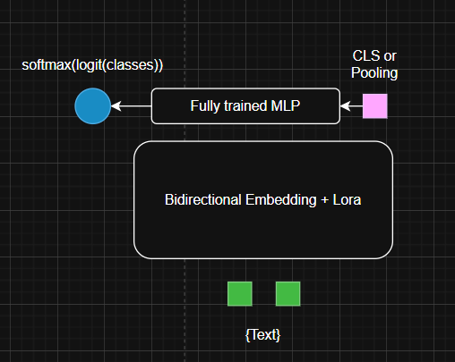
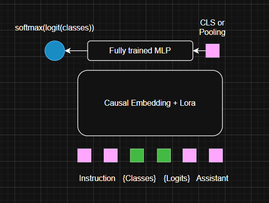
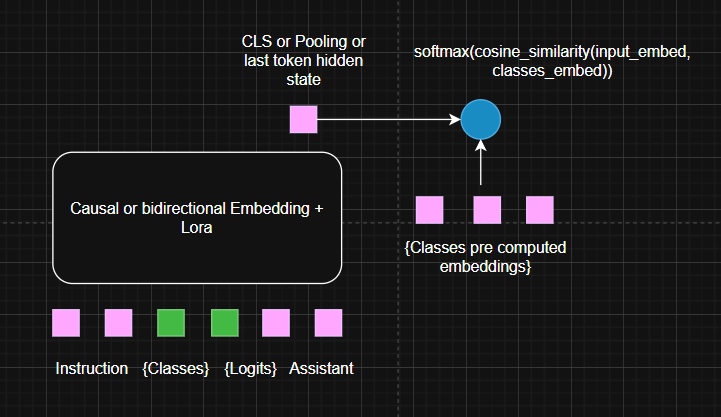
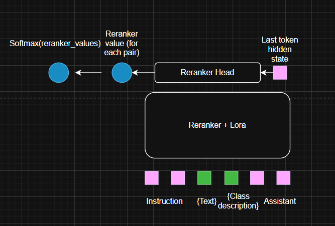
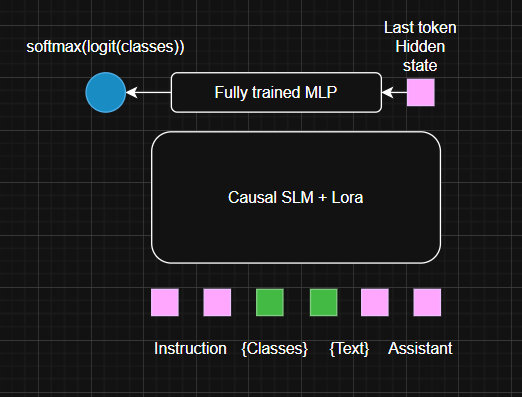
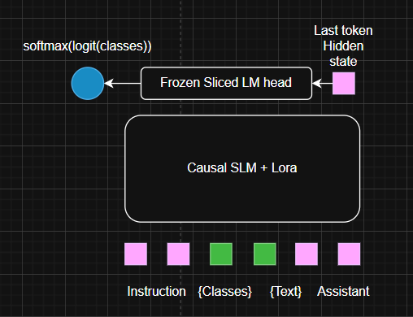
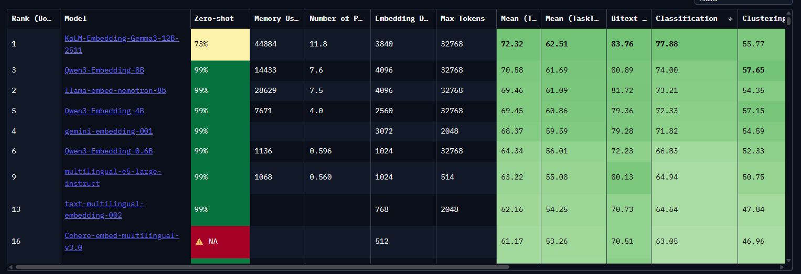
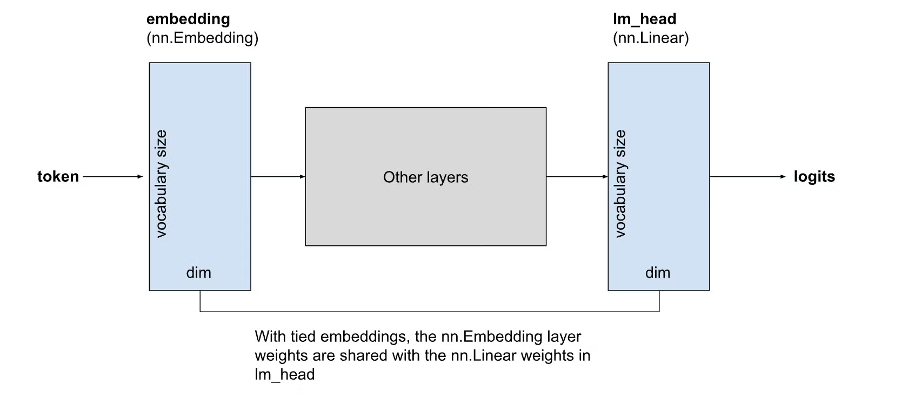

# From Speed to Stability: How SLMs can be adapted to deliver efficient, robust and instruction-aligned classification in a single forward pass

## TLDR

## Motivations

When training a multimodal reranker, I modeled it as a binary classification problem with a transformer backbone. 

Because of the multimodal aspect and the very poor performance of encoder only models compared to decoder only (even for embeddings, see Colpali) in mutlimodal embeddings and representations - mainly because of the discreptencies between training of both type of models and because of the real multimodality in the input being treated almost only in VLMs - I was "forced" to use Causal model for this classification task.

However, an interesting point I realized is that training only the core representation model - so only the linear layers of attention and FFN and not the embedding and LM head layer - performed the best on test sets and benchmarks after training (meaning better performance and less overfitting). Also using the LM head (and extracting logits - but I will focus on that later) worked better than plugging and training a specific MLP as an output to the last token embedding.

This can be explained because instead of tuning the last layer on a specific dataset and forcing it to fit the - most of the time - small number of example. By using the pre trained LM head for logits yes and no present several advantages :
- We can leverage the instruction following and in context learning capabilities of language model by explaining the classification task and expressing the meaning of the classes. Instead of letting the model understand it through backpropagation and "waste" some compute and training example to make it figure out the task and then improve at the task, we can directly start at the becoming good at the task.
- Since we are training and modifying only the core model and not the first layer (embedding layer) and last layer (frozen lm head instead of fully trained MLP, now most of the time tied to the embedding - see section of this blog on tie embeddings) the train model is more robust to overfiting and better in OOD examples of the same task (+ LoRa already reduces overfitting in the core model). We can see it as : we are not modifying the "decision" but only the "represention" (like intermediate vectors / embedding) that are used for the "decision" (the final classification).

This was true for the binary classification task and multimodal - which may be a niche in the industry. But is it true for more complete task (multiclass classification) in the text only area, where embeddings and encoder only models are really good and mainly used in classification tasks (intent classification, NER, ...) plugged to an MLP ?

I decided to run several ablations on this subjects to compare methods for multiclass text classification to the single forward pass architecture I used for the reranker.

## Classifications strategies

I will first describe the different techniques that are mainly used when you want to perform text classification (binary or multiclass).

### Embedding + MLP

The main technique used for classification tasks (intent classification, NLU, NER, emotion classification, ...) is to plug a text embedder to a decision maker, so most of the time, a transformer encoder represent the text input into a rich vector and then an MLP extract the classes with a final softmax or sigmoid activation depending on the task. It was mainly done with biderectional encoders (derivated from BERT) that are pretrained on Mask Language Modeling and postrained on sentence representations through pooling and constrative learning (like multilingual-e5 or gte-embedding).

After that, encoder only models where also given the "instruction" capabilities, meaning you can explain deeper your task to the model so the embeddings are a bit more adapted to what you want to do (for example you could explain the classification task or the retrieval task and say that you give the query or the document, see Jina's embedding v4 where they even train a LoRa per task ADD LINK or multilingual-e5-instruct).

Nowadays, embedding can also be decoder / causal embeddings when SLMs are postrained following constrative learning recipe. This is the case of qwen3-embedding-0.6B which transforms qwen3-0.6B into an embedder - leveraging instruction - by applying the gte embedding constrative learning recipe. Those are the best embedders in most of the tasks according to the MTEB leaderboard (ADD LINK) - this is actually the closest technique to what I present in this blog except you need a fully trained MLP.

### Semantic similarity

Most of the embedders / encoders are trained for similarity tasks (because of the focus on retrieval task in benchmark, use cases and training). So you can leverage those model as bi-encoders where you encode the input and the description of all classes separatly and create a score using cosine distance. You can precompute the classes vectors at inference time and apply a softmax to the scores to get a probability.

### Reranker / Natural language inference pairs

Another technique used in NLP is called Natural Language Inference and is really close to reranking tasks (see for example the paper : Political DEBATE: Efficient Zero-shot and Few-shot Classifiers for Political Text). The concept of NLI is almost as the Next Sentence Prediction of the original training of BERT. You present a text and a description of class and the model classifies the relevancy between the 2 subjects. So you can use text reranker in this setup, such as qwen reranker.

The only issue is that on the opposite of all the previous techniques where you need a single forward pass to classify at inference time, NLI and rerankers work as cross-encoders meaning you cannot precompute anything. You need to perform each pairs of input / class for every input. In multiclassification problems, it can become very expensive (you multiply your compute budget by the number of classes).

Even if cross encoding is robust (that's why rerankers are use as a final layer before generation in RAGs), it makes it unrealistic for fast classification tasks - even more on CPUs.

### Naive LLM classification + parsing

Now, we will start speaking about LLMs. When people want to classify using LLMs, I used to become irritated. Why would you use big models to just get a single class which is a sinple score. You need to let the model do all its generation / autoregressive process, beg him to return your class name in between some irrelevant tokens, try some regex or fuzzy match to find your class tokenS inside the completion and you can barely have a real probability of it.

### SLM last token hidden state + MLP

A more clever way to do this task is to use a single forward pass to get the last token hidden state (just like it is done in qwen embeddings) and plug it to a fully trained MLP. There, you can fine tune the model and it is not an autoregressive task.

### SLM single forward pass

Finally what I saw worked the best in the binary classification problem + multimodal task was to use a Small Language Model (the size of the encoder only), perform a single forward pass and extract the logits of the class tokens from the LM head. There, you can instruct the model with the task and ask him (+ train him) to answer directly with the class token. If you do a softmax with only the X logits representing your X classes (and present in the prompt), you have access to real probabilities of the classes.

One constraint is that you need to find a way to present your class with DISTINCT first logit. 

A variant is to use proxy to your classes by giving correspondances (to letters A,B,C,D, ...) in the instruction and use those proxy logits as classes.

With that, you can leverage strong training of Causal models (multilingual, knowledge, huge pretraining, post training and RL on task), intruction following abilities (you can skip the adaptation to the task because you explain the task in the prompt and go directly to model improvment) and it costs a single forward pass and provides you real probability of classes.

## Training Setup

### Datasets

To evaluate those assumptions and compare multiclass classification strategies in a relevant way, I used 2 datasets :

#### German Intent classification : DFKI/radr_intents

I first used DFKI/radr_intents an intent classification dataset in German with 2610 examples in the train set, 310 in the validation set and 605 in the test set. 

Task is classification with 8 classes : call, call_response, info_request, info_provide, confirm, disconfirm, order and other with the following repartition :

| Label           | meaning        | train | percentage | example                                                                                       |
|----------------|----------------|-------|------------|------------------------------------------------------------------------------------------------|
| 0              | disconfirm     | 35    | 1.3%       | Ist negativ, noch nicht.                                                                      |
| 1              | order          | 216   | 8.3%       | Für Sie Erkundungsauftrag: Gesamtüberblick über die Einsatzstelle. Kommen.                    |
| 2              | info_provide   | 979   | 37.5%      | Ich verlasse das Erdgeschoss und gehe ins erste Obergeschoss.                                 |
| 3              | info_request   | 238   | 9.1%       | Frage: Erkundungsergebnis aus der östlichen Seite des Gebäudes, kommen.                       |
| 4              | call           | 487   | 18.7%      | RobLW an Zugführer, kommen.                                                                   |
| 5              | call_response  | 370   | 14.2%      | Ja, hier ist Zugführer, kommen.                                                               |
| 6              | other          | 43    | 1.7%       | Einen Augenblick, ich melde mich gleich.                                                      |
| 7              | confirm        | 242   | 9.3%       | Ein Lagebild von oben, komplette Lage, und ein Lagebild zwischen den beiden Türen, verstanden. |

When working in intruct mode / with a SLM I used the following prompt :

    CLASSIFICATION_PROMPT = """
    You classify a sentence into one of these classes:

    - disconfirm — deny, reject, disagree.
    - order — give a command or instruction.
    - provide_info — give information or a status update.
    - request_info — ask for information.
    - call — call someone on the radio (e.g., “Unit A to Unit B”).
    - response_call — respond to a call (e.g., “Here is Unit B”).
    - other — anything not fitting the above.
    - confirm — acknowledge, agree, confirm understanding.

    Task: Given a sentence, return only the class name.

    Sentence: {sentence}

    Answer:
    """
When working with an instruct encoder I used the following instruction :

    TASK_DESCRIPTION = """You classify a sentence into one of these classes:

    - disconfirm — deny, reject, disagree.
    - order — give a command or instruction.
    - provide_info — give information or a status update.
    - request_info — ask for information.
    - call — call someone on the radio (e.g., “Unit A to Unit B”).
    - response_call — respond to a call (e.g., “Here is Unit B”).
    - other — anything not fitting the above.
    - confirm — acknowledge, agree, confirm understanding."""

You would notice that I modified a bit the classes name so I am sure to have distinct first tokens for each classes.

This small datasets would help me to evaluate the different methodologies in a complex and multilingual setup (the prompt and classes being in english and the input in german).

#### English emotion classification : DFKI/radr_intents

I then used dair-ai/emotion, an English emotion classification dataset with 6 classes : sadness, joy, love, anger, fear and surprise. The dataset contains 16k examples in training, 2k in validation and 2k in test.

I used this prompt for SLM classification instruction :

    CLASSIFICATION_PROMPT = """
    You classify a sentence into one of these classes:

    - sadness 
    - joy
    - love
    - anger
    - fear
    - surprise

    Task: Given a sentence, return only the class name for the emotion of the sentence.

    Sentence: {sentence}

    Emotion:
    """

And this instruction for embedding task description :

    TASK_DESCRIPTION = """You classify the emotion of a sentence into one of these classes:

    - sadness 
    - joy
    - love
    - anger
    - fear
    - surprise
    """

### Models

Regarding models, to have the most fair evaluation I picked :

- Qwen/Qwen3-0.6B for the SLM
- Qwen/Qwen3-Embedding-0.6B for the Causal Instruct embedding
- intfloat/multilingual-e5-large-instruct for the Bidirectional encoder instruct embedding

Those choices where made to be the most fair. First, Qwen3 0.6B and Qwen3 Embedding 0.6B share the same architecture, pre training and size (embedding is derived from instruct as explained). E5 is also a 0.6B parameters embedding that can work with instruction and that has the best performances in its parameters range (as an encoder only) in MTEB and is positionned just after Qwen Embedding :

When needing an MLP, it was always directly plugged to the sentence embedding (so mean pooling or last pooling) with a Linear layer of dimension (embedding_dim, embedding_dim), a ReLu activation and the final projection layer, a Linear of dimension (embedding_dim,classes). Final logits where always transformed to a probability with a softmax.

    self.score_head = nn.Sequential(
                nn.Linear(hidden_size, hidden_size),
                nn.ReLU(),
                nn.Linear(hidden_size, num_classes)
            )

### Hyperparameters and LoRa

All training where done with a LoRa of rank 16, alpha 32 and dropout 0.05 applied to all linar layers of the attention and FFN. MLP where always fully trained and LM heads and embedding always frozen.

The loss used is the cross entropy loss. To not favor any training optimizer used was AdamW with beta1 0.9, beta2 0.999, epsilon of 1e-8 and a linear decay learning rate setup to 5e-5.

Batch size is set to 8 with no gradient accumulation.

Target metric is macro F1 score but weighted F1 score is also followed during training.

## Results

I first compared all the techniques that could achieve globaly the same inference speed with this setup on the German dataset.

Here is the description of the different setup you can find in the table :

- SLMLogitsClassifier : Qwen 3 0.6B with prompt and LM head logit based classification - logits are first token of each class name
- SLMLetterClassifier : Qwen 3 0.6B with prompt and LM head logit based classification - logits are letters mapped in the prompt as the class name
- SLMHiddenStateClassifier : Qwen 3 0.6B with prompt, extraction of last logit hidden state (last token pooling) and MLP
- CausalEmbeddingClassifier : Qwen 3 0.6B embedding (last token pooling) and MLP without instruction 
- CausalEmbeddingInstructClassifier : Qwen 3 0.6B embedding (last token pooling) and MLP with instruction
- BidirectionalEncoderInstructClassifier : multilingual e5 instruct + MLP with instruction
- SemanticSimilarityClassifier : Qwen 3 0.6B embedding used as a bi encoder for semantic similarity with classes

| Model | Test Macro F1 | Test Weighted F1 |
|-------|----------|-------------|
| **SLMLogitsClassifier** | **0.75997** | **0.83072** |
| **SLMLetterClassifier** | 0.70389 | 0.79929 |
| **SLMHiddenStateClassifier** | 0.72223 | *0.81756* |
| **CausalEmbeddingClassifier** | 0.69086 | 0.78130 |
| **CausalEmbeddingInstructClassifier** | *0.75248* | 0.81308 |
| **BidirectionalEncoderInstructClassifier** | 0.66300 | 0.77619 |
| **SemanticSimilarityClassifier** | 0.59390 | 0.74067 |

This training was done on 3 epochs while keeping the best validation performance to test on the test set.

I then compared the best working techniques (SLMLogitsClassifier, CausalEmbeddingInstructClassifier and BidirectionalEncoderClassifier as a baseline for what is done the most nowadays) on more data with the emotion classification task :

| Model | Test Macro F1 | Test Weighted F1 | Peak Training Macro F1 (on val) | Peak Training Weighted F1 (on val) |
|-------|---------------|------------------|-------------------------|----------------------------|
| **SLMLogitsClassifier** | **0.88437** | **0.92533** | *0.905* | *0.93* |
| **CausalEmbeddingInstructClassifier** | *0.87876* | *0.91969* | **0.91** | **0.936** |
| **BidirectionalEncoderInstructClassifier** | 0.85633 | 0.90050 | 0.899 | 0.924 |

We can make several observations :

- Overall, on both benchmarks, the SLM Logit based (with the LM Head) performs the best on the validation set.
- Using an Instruct embedding with an SLM as a base model seems better for classification in both tasks mainly because pre training and instruction following is way more covered than encoder only. However, we loose the bidirectional aspect that could be very interesting to keep or regain for some tasks / inputs. Llama nemoretriever colembedd by nvidia present a way to reactivate bi-directional ie removing causal mask on a causal embedding with training, see : https://arxiv.org/pdf/2507.05513.
- We observe a more stable relationship between validation and training set when we use the LM head instead of an MLP, showing changing only the "representation" and not the "decision" leads to less overfit and a more robust and stable performance on unseen / untuned inputs (which is what I saw when training the multimodal reranker).

### Very small language models

I also choose the english dataset because I wanted to test even smaller models. There are very few SLM that are actually *small* to match encoder only parameters (and meaning that you can afford to wait a single forward pass on a CPU with a correct time). I tested HuggingFaceTB/SmolLM2-360M-Instruct and ibm-granite/granite-4.0-350M. Moreover, Pleias AI did a great job achieving almost the same results on MMLU with Qwen 0.6B with the model Baguetotron (321M) and impressive results with Monad (56M). Those model enderwent a single mode of training on the SYNTH dataset and were not targeted on the instruction following (mainly knowledge retrieval and creativity according to the blog). I still wanted to try it. 

| Model | Test Macro F1 | Test Weighted F1 |
|-------|---------------|------------------|
| **Baguetotron (3 epochs - 360M)** | 0.83096 | 0.88265 |
| **SmollLM2-instruct (3 epochs - 321M)** | 0.875 | 0.924 |
| **Monad (5 epochs - 56M)** | 0.72865 | 0.86547 |
| **E5 small (3 epochs - 100M encoder only with MLP)** | 0.8646 | 0.9082 |

SmollLM 2 Instruct achieve almost the same results as the SLMLogitsClassifier (that plateaued and overfited) showing that with more epochs we can achieve top performances with this technique with very small langage models (after 1 epochs, results where 0.86 for the Macro and 0.89 for the weighted so epochs are needed but learning curve is good).

Unfortunatly, probably due to the lack of instruction following, results are not as good as embedding + MLP of the size range for the Pleias models. Yet with instruction tuning and RL on the base model, it could be interesting to see how result can match 0.6B models on classification tasks, mostly for the 56M that is very small. I saw some DPO work on the 300M on twitter that seem very intersting (recall no RL was done on the model for now).

## Optimization and tie embeddings

One could say that using the LM head is overkill because it is one of the biggest components of the SLM in term of parameters. Yet as explained, since we only need X classes, we only use X logits from the token vocabulary of the LLM. Therefore, we can reduce a lot the size of the model. Actually with tied embeddings, it is more a reduction of effective size rather than memory size.

I will reuse a bit of the explanation I did in my multimodal reranker blog (ADD LINK) and adapt it to this one.

Using the complete logit outputed by the LM head is(since we don't sample token with softmax, temperature and so on) and slicing the 2 token that we care about like that :

Is the same as slicing the LM head when loading and use it like that in term of output :

However, in term of effective size of the model,  parameters are reduced by a lot.

Indeed, Qwen 3 0.6B has **596049920** without the LM head, the hidden dimension is 1024 and the vocab size is 151936, so the number of parameters in the LM head is 1024* 151936 = **155 582 464** (so a total of **751 632 384** effective parameters). When slicing the LM head for the only X useful tokens (let's take 8 as the first dataset), the size is of this last layer is 1024 * 8 = **8 192**. The LM head was previously 20% of the model and now is negligable compare to the backbone.

When applying an MLP with 2 layers of shape (hidden_dim,hidden_dim) and  (hidden_dim,X). The parameters count is 1024 *1024  + 1024 * 8 = **1 056 768** parameters.

Using the logits allows a better memory / FLOPs / size reduction in addition to have a pretrained layer instead of a fully initialized one. Be aware that it is not necessary a memory optimization since some models are using tied embedding meaning the embedding layer and the lm_head share the same memory (but it is still a reduction of "effective parameters" - related to number of operations, but not necessary "memory parameters").

Tie memory are presented as following :

Nowadays, most of the models use tie embeddings. It reduces the number of parameters but also prevent overfitting for models like transformers that are very deep since the input and output of your model (embedding and LM head) share the same parameters. This is an additive reason to use frozen LM head as the classifier instead of a decoupled MLP.

Moreover, even if it does not reduces the number of parameters in the VRAM, it does not need to load in the SMs the complete LM head when doing the end of the single forward pass, reducing inference cost in addition to reducing FLOPs.

It also improve training since backpropagation is not calculated for the complete vocabulary but only for the X tokens of the classes.